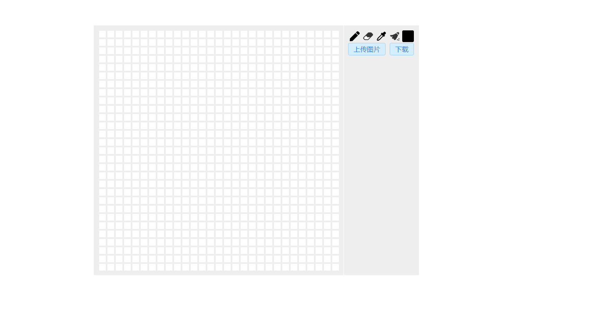

## Pixeldraw
- [Screenshot](#screenshot)
- [Background](#background)
- [Install](#install)
- [Usage](#usage)
- [Maintainers](#maintainers)
- [License](#license)

## Screenshot



## Background

使用canvas开发的一个小像素画板，原生js实现

## Install

```shell
$ npm install
```

## Usage

```shell
#build
$ npm run build

# or start in devloper mode
$ npm run dev

```
import drawing.js

```html
<script src='/bundle.js'></script>
<body>
    <div id="main">
    </div>
    <script>
        var d = new Drawing({
            el:'main'
        });
        d.createPixel();
    </script>
</body>
```

## Maintainers

[@WesLin](https://github.com/wes-lin).

## License
[MIT](https://github.com/wes-lin/Pixeldraw/blob/main/LICENSE)

